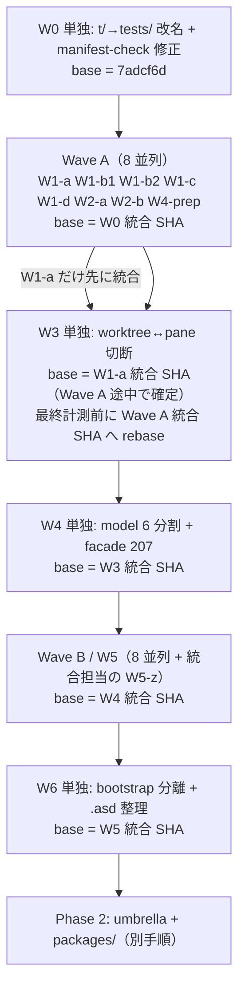

# packages/ 再編 — 並列実行手順書

`src/`（本体）+ `packages/<name>/`（feature 単位の独立 ASDF システム）への再編に向けた
前段整理の手順。**複数セッションに並列で配る前提**で、波（wave）ごとに
「同時に走らせてよいタスク」と「統合順」を確定してある。

- 対象リポジトリ: `nerima-lisp/nerimux`（bare clone。作業は `<repo>.git/.worktrees/` 配下の
  worktree で行う）
- **起点コミット: `7adcf6d`（main）**。旧手順書の `a0b541e` は使わない
- 本書の行番号・件数は `7adcf6d` に対する実測。**着手時に必ず再計測する**

---

## 0. 全セッション共通の約束

この節は**どのタスクを受け取ったセッションも最初に読むこと**。

### 0-1. worktree で隔離する（必須）

```sh
cd <repo>.git
BASE=<そのタスクに指定された SHA>     # 波ごと・タスクごとに指定。main とは限らない
git worktree add -b <branch-name> ".worktrees/$(date +%Y%m%dT%H%M%S)-$(git rev-parse --short $BASE)" "$BASE"
```

`git stash` / `git checkout <既存ブランチ>` / `git switch` / `git reset --hard` / `git clean -f` は
禁止（フックがブロックする）。**`BASE` は指定されたものを使う。** 既定の main から切ると
前の波の成果が無い木で作業し、「これが無い」という誤報告と別ベースへの計測値が出る。

### 0-2. コミットとブランチ

- git の書き込み操作（commit / push / tag / rebase / merge / `gh pr create`）は、
  **ユーザーがその時点で明示的に指示した場合のみ**。過去の許可は繰り越さない
- デフォルトブランチへは絶対にコミットしない
- コミットは `git commit -- <明示パススペック>`。`add` 側だけのパス指定では
  並行セッションの stage が相乗りする

### 0-3. 編集の作法

| ルール | 理由 |
|---|---|
| 編集直前に必ず `Read` で読み直す | 前ターンの `old_string`・grep 抜粋・記憶は並行編集で陳腐化する。このリポジトリで最頻の失敗 |
| Lisp の構造編集は `paredit` | 括弧を手で数えない |
| **行単位のスクリプト削除をしない** | `:export` と `:components` で 3 回、閉じ括弧ごと消して親フォームを壊した |
| テキスト置換は `perl`（`sed`/`awk` 禁止） | フックがブロックする |
| パス・シンボル名を推測しない | `Glob`/`Grep`/`ls`/Serena で確定してから逐語で使う |
| スクラッチファイルは自分の worktree 内に置く | `/tmp/` の一般名は並行エージェントに上書きされ、しかも上書き版はエラーを握り潰して exit 0 した実績がある |
| コメントは原則書かない | 追加するのはコードが示せない WHY のみ |

### 0-4. 検証コマンド

```sh
# 静的検査 5 本。パイプを挟まないこと（後述）
sbcl --script scripts/checks/read-check.lisp
sbcl --script scripts/checks/manifest-check.lisp
perl  scripts/checks/export-check.pl .
perl  scripts/checks/internal-call-check.pl .
perl  scripts/checks/suite-structure-check.pl .

# 個別スイート（cl-weave のテスト名の部分一致。describe 名でも it 名でも当たる。tests/suite.lisp:17）
CL_WEAVE_TEST_FILTER=<部分文字列> nix run 'path:.#test' --print-build-logs

# フルスイート / flake check / ビルド / docs
nix run 'path:.#test' --print-build-logs
nix flake check --print-build-logs
nix build .
nix build .#docs
```

- **`path:.#` 形を使う。** 未 add の新規ファイルがある間、`.#` 形は git-tracked フィルタで
  それを flake source に入れない
- **`| head` / `| tail` を挟むと `$?` がパイプ末尾の終了コードになる。** exit status は
  ファイルへリダイレクトしてから読む:
  ```sh
  perl scripts/checks/suite-structure-check.pl . > c.txt 2>&1; echo "exit=$?"
  ```
- **`nix build .#coverage-report` は使わない**（45 分デッドロック）
- **`asdf:load-system` の直接実行は通らない。** `run-tests.lisp` 経由
- **W0 統合前は、`.worktrees/` 配下から `manifest-check` を走らせると必ず赤になる**
  （`manifest-check.lisp:34` の `(search "t/" s)` が `nerimux.git/` の末尾に先にマッチし、
  201 件全部が MISSING+ORPHAN になる）。これはハーネス欠陥で W0 が直す。W0 以外のタスクは
  W0 統合後の BASE で始まるので影響しない
- **W0 統合後、テストディレクトリは `tests/`。** 本書のコマンドはすべて `tests/` で書いてある

### 0-5. ベースライン（`7adcf6d`、verified）

| 検査 | 値 |
|---|---|
| フルスイート | **2372 passed / 1 skipped / 0 failed（2373 total）**、exit 0 |
| read-check | 378 files、緑 |
| export-check | packages 21 / single-colon references 3981、緑 |
| internal-call-check | helpers 926 / files 372、緑 |
| manifest-check | 201 = 201（Nix サンドボックス内では緑。ローカル worktree では上記欠陥で赤） |
| suite-structure-check | **exit 1、「not inside a describe」31 件 / 9 ファイル**、scanned 198 |

回帰判定は件数で比べる:

```sh
perl scripts/checks/suite-structure-check.pl . 2>&1 | grep -c "not inside a describe"
```

### 0-6. 緑を信用してよい範囲

- PTY テストは非決定的。単独の緑を回帰の証拠にしない
- renderer の予算テストは機械負荷で落ちる。CI でも以前から赤
- `nerimux/test` は `system/asdf-test-components.lisp` に列挙されたファイルだけロードする。
  **新規テストファイルは manifest 登録と `git add` の両方が要る**
- `nix build` の exit 0 はシンボル解決の証拠にならない。`export-check.pl` が見る
- **テスト件数の数え方**: `dolist` で回している箇所は全行で 1 ケース

### 0-7. 報告フォーマット

```
status        success | warning | error
summary       やったこと
evidence      所見ごとに file:line か実行コマンド、verified / inferred / assumed のタグ
verification  実行した検査コマンドと exit status。実行していないなら "none run"
gaps          依頼されたが出来なかったこと と その理由（無いときは省略）
```

`status` は証拠についての言明。`success` は「設定した検査が全部走って通り、assumed が
残っていない」状態のみ。**数値の自己評価（達成率・確信度・所要時間）は書かない。**
数えたもの（触ったファイル数、呼び出し箇所数、影響したテスト数）で書く。

---

## 1. 波の構成と依存



**波の中は並列、波と波の間は直列。** 同一波のタスクは編集対象ファイルが互いに素になるよう
切ってある。共有ファイル（`nerimux.asd` / `system/asdf-test-components.lisp` /
`src/bootstrap/package-*.lisp` / `tests/package.lisp`）は波ごとに所有者を 1 タスクに固定する。

| 波 | BASE | 統合順 |
|---|---|---|
| W0 | `7adcf6d` | — |
| Wave A | W0 統合 SHA | **W1-a → 即 SHA を W3 へ周知** → W1-b1, W1-b2 → W1-c, W1-d → W2-b → **W2-a（最後）** |
| W3 | W1-a 統合 SHA | Wave A 統合 SHA へ rebase してから最終計測 |
| W4 | W3 統合 SHA | — |
| Wave B | W4 統合 SHA | W5-a〜h 任意順 → W5-z（統合担当） |
| W6 | W5 統合 SHA | — |

---

## 2. W0 — `t/` → `tests/` 改名 + manifest-check 修正（単独）

**base = `7adcf6d`**

### なぜ

Phase 2 の per-package レイアウトは `packages/<name>/tests/`（`nerima-lisp/cl-cc` の実構成、
`packages/parse/tests` 等）。ルートのテストディレクトリも `tests/` に揃える。`tests/` を触る
後続タスクが 10 以上あるので、**最初に単独で通す**。

同時に `scripts/checks/manifest-check.lisp` の欠陥を直す。オンディスク側のパスを
`(subseq s (search "t/" s))` で求めており、`.worktrees/` 配下では `nerimux.git/` の `t/` に
先にマッチして全件 MISSING+ORPHAN になる（verified）。

### 対象（コードとして効く参照は 9 箇所。verified）

| ファイル | 変更 |
|---|---|
| `t/` 全体 | `git mv t tests` |
| `nerimux.asd:337` `:374` | `:pathname "t"` → `"tests"`、`"t/pty"` → `"tests/pty"` |
| `system/asdf-test-components.lisp:4` | 最上位 `(:module "t"` → `"tests"`。manifest-check の walker がこの名前からパスを組む |
| `scripts/checks/suite-structure-check.pl:22` / `export-check.pl:55` / `internal-call-check.pl:24` | `find 't'` → `'tests'` |
| `scripts/checks/manifest-check.lisp:34,42,46` | `(search "t/" s)` を廃し、リポジトリルートの truename からの相対パスで求める。`"t/**/*.lisp"` → `"tests/**/*.lisp"` |
| `flake.nix:544` | `t/e2e/e2e-smoke.lisp` → `tests/e2e/e2e-smoke.lisp` |
| プロース | `scripts/checks/README.md`、`README.md`、`docs/src/{getting-started,benchmarks}.md`、`docs/src/guide/{development-rules,sibling-libraries}.md`、`docs/src/reference/architecture.md`、`tests/pty/helpers.lisp`（7 箇所、全部コメント）、`tests/e2e/*`、`src/` 6 ファイルのコメント |

`tests/e2e/e2e-smoke.lisp:32` の「2 階層上」計算はディレクトリ名に依存しない。
**`docs/notes/` の `t/` 表記は触らない**（W1-d の担当）。

### やってはいけないこと

- 改名以外の内容変更（テストの中身、manifest の構造）
- `.asd` / manifest を行単位で編集しない。`paredit` を使う

### 検証

```sh
sbcl --script scripts/checks/manifest-check.lisp > c.txt 2>&1; echo "exit=$?"; cat c.txt   # この worktree から exit 0 になること
sbcl --script scripts/checks/read-check.lisp
perl scripts/checks/export-check.pl . > c2.txt 2>&1; echo "exit=$?"
perl scripts/checks/internal-call-check.pl . > c3.txt 2>&1; echo "exit=$?"
perl scripts/checks/suite-structure-check.pl . 2>&1 | grep -c "not inside a describe"   # 31 のまま
grep -rnE '(^|[^a-zA-Z0-9_./-])t/' nerimux.asd flake.nix scripts/ system/                 # 0 件
nix run 'path:.#test' --print-build-logs
nix flake check --print-build-logs
nix build .#docs
git diff --check
```

### 完了条件

- **`.worktrees/` 配下の worktree から** manifest-check が exit 0、201 = 201
- フルスイート 2372 / 1 / 0 と一致、5 検査の走査件数が 0-5 と一致
- `nix flake check`、`nix build .#docs` 緑
- 統合担当は統合後の SHA を **Wave A の BASE** として周知

---

## 3. Wave A — 整理 + ゲート整備（8 並列）

**base = W0 統合 SHA**

| タスク | 担当ファイル（互いに素） | 統合順 |
|---|---|---|
| W1-a | `tests/unit/domain/model/attention-tests.lisp` | **1**（→ W3 の BASE） |
| W1-b1 | `tests/integration/` の 4 ファイル | 2 |
| W1-b2 | `tests/unit/` の 5 ファイル | 2 |
| W1-c | src コメント 3 ファイル + `tests/unit/feature/` + **manifest（独占）** | 3 |
| W1-d | `EXECUTION.md` の旧内容の整理、`docs/notes/` | 3 |
| W2-b | `tests/unit/bootstrap/system-composition-tests.lisp`、`scripts/checks/export-check.pl` | 4 |
| W2-a | `flake.nix` の `checks` のみ | **5（最後）** |
| W4-prep | 編集なし（読み取り専用） | 統合対象なし |

### W1-a — pane→worktree attention の特性化テスト（model 層）

**Wave A で最初に統合するタスク。W3 の受け入れ基準になる。**

#### なぜ

`src/domain/model/worktree.lisp:101-102` の
`(when (some #'pane-attention-p (worktree-panes worktree)) (push :pane reasons))` は、
model 層の直接テストが無い。`worktree-attention-reasons` / `-p` に言及する `tests/` の
アサーションは 4 件（`attention-tests.lisp:16,17`、`organization-tests.lisp:76,77`）で、
どれも worktree に pane を attach していない。

**間接カバレッジは存在する**: `tests/unit/presentation/renderer/renderer-tui-kit-tests.lisp:398-443`
が `worktree-add-pane` + `pane-mark-output` の後に `"! github.com/team/repo · feature/ui"` を
期待している。ただし失敗時に教えてくれるのは「`!` が描かれない」までなので、W3 の局所化の
ために model 層の直接テストを足す。

#### やること

`attention-tests.lisp` の `describe "worktree attention"`（`:3`）に `it` を追加する。
満たすべき振る舞い:

1. attention 状態の pane を `worktree-add-pane` で繋ぐと `worktree-attention-reasons` に
   `:pane` が含まれる
2. その worktree を repository → organization に繋ぐと `organization-attention-count` が
   1 件として数える
3. pane が attention 状態でなければ `:pane` は含まれない

pane を attention にする手段は `attention-tests.lisp:51` の `pane-mark-bell` 等。
既存の書き方に合わせる。

#### 空振り確認（必須）

1. 追加テストが無改変の木で緑
2. `worktree.lisp:101-102` を一時的にコメントアウト → **追加テストが赤**
   （`renderer-tui-kit-tests.lisp:398` も赤になるはず。両方報告）
3. 元に戻して緑

#### やってはいけないこと

- `worktree.lisp` を恒久的に変えない。既存 3 つの `it` を書き換えない

#### 検証

```sh
CL_WEAVE_TEST_FILTER="worktree attention" nix run 'path:.#test' --print-build-logs
perl scripts/checks/suite-structure-check.pl . 2>&1 | grep -c "not inside a describe"   # 31 のまま
sbcl --script scripts/checks/read-check.lisp
```

#### 完了条件

追加した `it` の件数と名前、空振り確認 3 手順の結果（2 で赤になった件数）、
suite-structure が 31 から増えていないこと。

---

### W1-b1 / W1-b2 — `describe` の外に出た 31 件を直す

#### なぜ

`describe` の外の `(it ...)` は cl-weave のツリーで root 直下に付く。原因は閉じ括弧の過多。
`scripts/checks/README.md:57` は「外でも走る」と書いているが**実測はされていない**。

#### 対象（`perl scripts/checks/suite-structure-check.pl .` の出力、verified）

| タスク | ファイル | 件数 |
|---|---|---:|
| W1-b1 | `tests/integration/client-tests-command-client.lisp` | 10 |
| W1-b1 | `tests/integration/server-multi-tests-loop.lisp` | 7 |
| W1-b1 | `tests/integration/workspace-input-prefix-tests.lisp` | 3 |
| W1-b1 | `tests/integration/server-multi-tests-message-dispatch-errors.lisp` | 1 |
| W1-b2 | `tests/unit/presentation/renderer/renderer-workspace-tree-tests.lisp` | 3 |
| W1-b2 | `tests/unit/domain/terminal/cell-display-tests.lisp` | 3 |
| W1-b2 | `tests/unit/domain/terminal/parser-osc52-tests.lisp` | 2 |
| W1-b2 | `tests/unit/presentation/renderer/renderer-tui-kit-tests.lisp` | 1 |
| W1-b2 | `tests/unit/domain/model/organization-tests.lisp` | 1 |

#### やること

各ファイルで `describe` が早く閉じている箇所を特定し、**閉じ括弧を正しい位置へ移す**。
`paredit` を使う。

#### やってはいけないこと

- テストの中身を変えない。行単位スクリプトで括弧を消さない
- 外に出ていたテストを削除しない。**suite に入れた結果赤になるテストは、報告して指示を仰ぐ**
  （直すのも消すのも避ける）

#### 検証

```sh
perl scripts/checks/suite-structure-check.pl . > c.txt 2>&1; echo "exit=$?"; cat c.txt
sbcl --script scripts/checks/read-check.lisp
nix run 'path:.#test' --print-build-logs
```

#### 完了条件

- 担当ファイルの「not inside a describe」が 0 件（もう一方のタスクの分は残っていてよい。
  件数で報告）
- **フルスイートの pass 件数を修正前後で実測して報告する。** 走っていなかったなら増え、
  走っていたなら不変。どちらだったかを推測で書かない
- 赤になったテストがあれば件数と内容を `gaps` に

---

### W1-c — 死んだパッケージ参照の除去と `tests/unit/feature/` の再配置

#### 対象（verified）

1. 削除済み `nerimux/options` を指すコメント 3 箇所: `src/domain/model/pane-spawn.lisp:19`、
   `src/presentation/renderer/renderer-statusbar.lisp:25`、
   `tests/unit/feature/advanced-tests.lisp:27`。文面を現状に合わせるか、情報価値が無ければ削る
2. `src/domain/terminal/parser-osc-clipboard.lisp:10` の
   `nerimux/commands::%maybe-copy-to-clipboard` 参照コメント（DOMAIN → APPLICATION の上向き）。
   コード化したら違反になる旨が分かる文面にするか、消す
3. `tests/unit/feature/advanced-tests.lisp`（synchronize-panes / layout persistence /
   update-environment のテスト、冒頭は "Sprint 3 advanced features"）を
   `tests/unit/domain/model/` へ移し、`system/asdf-test-components.lisp:237` の
   `(:module "feature"` エントリを更新し、空になった `tests/unit/feature/` を消す

#### やってはいけないこと

- テストの中身を変えない
- manifest を行単位で編集しない。`paredit`
- **このタスクが manifest を独占する。** 衝突したら報告

#### 検証

```sh
sbcl --script scripts/checks/manifest-check.lisp > c.txt 2>&1; echo "exit=$?"; cat c.txt
sbcl --script scripts/checks/read-check.lisp
perl scripts/checks/export-check.pl .
grep -rn 'nerimux/options' src/ tests/            # 0 件
nix run 'path:.#test' --print-build-logs
```

#### 完了条件

manifest-check exit 0 で N = N、`grep` 0 件、フルスイート pass 件数が移動前後で**不変**
（移動なので変わったら異常）。

---

### W1-d — 旧 `EXECUTION.md` の整理

#### なぜ

`7adcf6d` 時点の `EXECUTION.md` は 407 行 / 11 見出しの作業日誌で、大半は git 履歴と重複する。
org の方針は「1 ファイルの変更内容はコミットメッセージ」。本書がそのファイルを置き換えて
いるので、旧内容は `git show 7adcf6d:EXECUTION.md` で読む。

#### やること

**全削除ではない。** 旧内容を、履歴から再現できない情報とできる情報に分ける。

| 再現できる（捨ててよい） | 再現できない（`docs/notes/` へ移す） |
|---|---|
| 統合した作業単位の一覧、各コミットの内容、差分・commit 検査の結果 | 削除した worktree / branch の由来と理由、権限の検証記録、保留にした作業単位と理由、ベースラインが赤かった事実とその範囲 |

`docs/notes/` は `docs/mkdocs.yml:59` の `not_in_nav` で公開対象外。W0 が残した `docs/notes/`
内の `t/` 表記（`coverage-audit-history.md` 32 箇所、`permissions-and-verification.md` 11、
`workspace-requirements.md` 10）を `tests/` に更新するのもこのタスク。

#### やってはいけないこと

- 本書（`EXECUTION.md`）の内容を変えない。旧内容の移し先は `docs/notes/` の新規ファイル
- `docs/notes/` の既存 4 ファイルは、上の `t/`→`tests/` 置換以外触らない
- `docs/src/` を触らない（`mkdocs --strict` の nav に載っている）
- タイムスタンプや陳腐化する件数を新たに書かない

#### 検証

```sh
nix build .#docs
git diff --check
```

#### 完了条件

`nix build .#docs` 緑、残した情報と捨てた情報の区分表。

---

### W2-a — 静的検査 5 本を `nix flake check` に接続する

#### なぜ

`scripts/checks/` の 5 本は CI にも `nix flake check` にも接続されていない
（`grep -rn 'read-check\|manifest-check\|export-check\|suite-structure\|internal-call' .github/workflows/ flake.nix`
が 0 件、verified）。31 件が溜まった原因。現在の `checks` は `flake.nix:441-458` の
`default` / `formatting` / `docs` の 3 つ。`.github/workflows/ci.yml` は `nix flake check` 1 ジョブ。

#### やること

`flake.nix` の `checks` に 5 本を追加する。既存 3 つの書き方に合わせる。Nix サンドボックス内で
`perl` と `sbcl` が使えることを**先に確認**。`ci.yml` は「粒度は `checks.*` に持たせる。
別ジョブはサンドボックスで出来ないことに限る」と明記しているので**ジョブは足さない**。

#### Wave A 中の受け入れ条件（重要）

このタスクが走る間、suite-structure-check は起点で赤（31 件）。**「無改変で緑」は
W1-b1/b2 統合後に統合担当が確認する。** このタスク自身の受け入れは:

1. 5 本すべてが `checks.*` として評価される
2. suite-structure が **31 件を赤として報告する**（= ゲートが本物の欠陥を検出する）
3. 他 4 本を 1 本ずつ意図的に壊して赤になる

| 検査 | 壊し方の例 |
|---|---|
| read-check | 適当な `.lisp` に閉じ括弧を 1 つ足す |
| manifest-check | manifest から 1 エントリ削る |
| export-check | 未 export のシンボルを単一コロンで参照する |
| internal-call-check | `%` ヘルパを 1 つ改名する |
| suite-structure-check | （起点で赤なので確認済み。W1-b 統合後に `describe` の閉じ括弧を 1 つ前倒しして再確認） |

**走査 0 件で緑になる接続（対象ディレクトリが空、フィルタが何にも当たらない）が最も危険。**
各検査の出力に走査件数が出ていることを確認する。

#### やってはいけないこと

- ゲートを緩めない（閾値、除外リスト、警告への格下げ）
- 既存 3 checks を書き換えない。`flake.lock` を更新しない。`ci.yml` を変えない

#### 検証

```sh
nix flake check --print-build-logs > c.txt 2>&1; echo "exit=$?"
# 壊し方を 1 本ずつ試し、そのつど exit が非 0 になることを確認
```

#### 完了条件

5 本の接続、壊したときの赤の報告（どう壊してどう出たか）、`git diff --stat` に `flake.nix`
以外が無いこと。

---

### W2-b — 層ガードを layout 非依存にする

#### なぜ（Wave A で最も重要）

層ガードはディレクトリレイアウトにハードコード結合している。Phase 2 でファイルを
`packages/` に移すと、**無言で検査対象から外れる**。

| 場所（verified） | していること | `src/` の外へ動かすと |
|---|---|---|
| `tests/unit/bootstrap/system-composition-tests.lisp:251` `%file-layer-name` | 先頭セグメントが 5 層ディレクトリ名でなければ NIL | `packages/...` は NIL → 除外 → スキップ |
| 同 `:457-462` | `src/` 配下を集める | `packages/` は列挙されない |
| 同 `:131` `:407` | `src/bootstrap/package*.lisp` を glob して層マーカーを読む | package.lisp を移すと対応表が空 |
| `scripts/checks/export-check.pl:24` | 同じ glob で `(:export ...)` を集める | export リストが空 → 空虚に緑 |
| 同 `:494` | `(expect (> (length layered-files) 50))` | 一部だけ移しても通る |

#### やること

1. 層判定の入力を `src/` と `packages/` の両方を扱える形に一般化する
2. defpackage の収集を「ツリー全体から `defpackage` を含むファイルを見つける」形に
   一般化する（`export-check.pl` も）
3. 空虚ガードを絶対値の下限から**保存則**に変える: 検査対象ファイル数を出力し、
   「`src` の減少数 = `packages` の増加数」を次の波以降で照合できるようにする

`packages/` はまだ無い。「あったら正しく扱う」形で書き、**空のディレクトリで空虚に緑に
ならない**ことを確認する。

#### 空振り確認（必須）

- `src/domain/` 配下に上位層参照を 1 行足すと赤
- `packages/<dummy>/` を仮に作って上位層参照を置くと赤（確認後に消す。コミットしない）
- 対象ファイル数 0 件のとき緑にならない

#### やってはいけないこと

- 除外リストを足さない（`:441-454` 周辺のコメントが理由を書いている）
- `export-check.pl` の exit code 契約（成功 0 / 失敗 非 0、走査件数を必ず出力）を壊さない。
  **W2-a が依存する**
- `export-check.pl` が二重コロンを検査しないのは意図的。変えない

#### 検証

```sh
CL_WEAVE_TEST_FILTER="system-composition" nix run 'path:.#test' --print-build-logs
perl scripts/checks/export-check.pl . > c.txt 2>&1; echo "exit=$?"; cat c.txt
```

#### 完了条件

`system-composition` 緑かつ検査ファイル数・参照数を出力、空振り確認 3 つの結果、
`export-check.pl` の「packages: N / references: M」が 21 / 3981 以上。

---

### W4-prep — model 分割の依存解析（読み取り専用）

#### なぜ

W4 は `nerimux.asd` と `package-domain-model.lisp` を全サブパッケージが共有するので
並列化できない。代わりに、W4 が必要とする「どのファイルがどのシンボルを、どのファイル／
パッケージから使っているか」を先に表にしておく。

#### やること

`src/domain/model/` の 20 ファイルについて、次を表にして**報告に載せる**（ファイルは作らない。
スクラッチは自分の worktree 内）:

- そのファイルが定義し `nerimux/model` が export しているシンボル
- 他の model ファイルから参照するシンボル（→ サブパッケージ間の `:use` 方向）
- `nerimux/terminal` / `nerimux/ports` から非修飾で使っているシンボル
  （`package-domain-model.lisp:11-12` の `:use` 由来で grep に映らないもの。読み取りで
  確定できない分は「コンパイルで確定」と明記）

分割先の初期案（ファイル名がそのまま境界）:

| 分割先 | 元ファイル |
|---|---|
| workspace-model | `organization` `repository` `worktree` |
| pane | `pane-core` `pane-geometry` `pane-spawn`（+ W3 が作る attention 合成ファイル） |
| layout | `layout` `layout-visitor` `layout-persistence` `layout-geometry` |
| window | `window-definitions` `window-core` `window-tree` `window-operations` `window-neighbor` |
| session | `session` `session-environment-process` `session-environment-overlay` `session-environment-child` |
| target | `target`（外部依存は `nerimux/text` のみ 7 サイト。`.asd:194-195` の別モジュール化は byte-identical 維持のためで依存上の理由ではない） |

#### 完了条件

20 ファイル分の表、循環の疑いがある箇所（W3 で切れているはずの worktree↔pane 以外にあれば）
の列挙、export 207 の分割先別の合計。

---

## 4. W3 — worktree↔pane の結合を断つ（単独・前倒し）

**base = W1-a 統合 SHA**（Wave A の途中で統合担当が周知する）。
**Wave A 統合 SHA が出たらそこへ rebase してから最終計測する。**

### なぜここでやるか

W4 で `worktree` と `pane` が別パッケージになると相互参照が `defpackage` の循環になる。先に断つ。

### 結合の実測地図（verified）

| 方向 | 場所 | 状態 |
|---|---|---|
| worktree → pane（読み） | `worktree.lisp:101-102` `(some #'pane-attention-p (worktree-panes worktree))` | **断つ対象。定義レベルではここだけ** |
| worktree → pane（データ） | `worktree.lisp:16` `panes` スロット（`:type list`、pane シンボルを持たない） | 残してよい |
| pane → worktree（書き） | `pane-core.lisp:42-46` `worktree-add-pane` | 既に pane 側。動かさない |
| 内部呼び出し | `worktree.lisp:108-111` `organization-attention-worktrees`、`:113-131` `organization-recompute-counts`（`:129` で `worktree-attention-p`） | **合成と一緒に移す** |

呼び出し側（src）: `worktree-panes` 20 / `pane-worktree` 22（setf 5）/ `worktree-add-pane` 7 /
`worktree-attention-p` 11 / `worktree-attention-reasons` 5。`organization-attention-*` /
`recompute-counts` の model 外呼び出しは picker 4 サイト・renderer 3 サイト。

### 方針（案 B「丸ごと移動」）

`worktree-attention-reasons` の `:pane` 合成、`organization-attention-worktrees`、
`organization-recompute-counts` を、**`pane-core.lisp` より後にロードされる model 内の新ファイル**
（例: attention 合成専用ファイル）へ**丸ごと**移す。`worktree.lisp` には ghq 事実
（conflict / dirty / ahead / behind / missing）だけを残す。

W3 時点では全部 `nerimux/model` 1 パッケージなので、**呼び出し側の diff は 0 行**。
`nerimux.asd` の `domain/model` モジュール（`:152-`）にファイルを 1 件足すだけ。

### やってはいけないこと

- **合成を分割して `organization-recompute-counts` を `worktree.lisp` に残さない。** それが
  「organization の attention 件数が pane 由来を数えなくなる」事故の唯一の経路
- **port 変数（`*pane-attention-predicate*` のようなフック）を導入しない。**
  `docs/src/reference/architecture.md:87-99` が「実装が 1 つしかない capability を port 変数に
  すると、install し忘れた port の fallback が静かに成功する」と明記
- `worktree-add-pane` を動かさない。W1-a のテストを書き換えない
- 案 A（`panes` スロットをレジストリへ）は採らない。スロットを外しても述語呼び出しが残れば
  参照は消えない

### 検証

```sh
CL_WEAVE_TEST_FILTER="worktree attention" nix run 'path:.#test' --print-build-logs
CL_WEAVE_TEST_FILTER="organization"       nix run 'path:.#test' --print-build-logs
CL_WEAVE_TEST_FILTER="bare repository overview" nix run 'path:.#test' --print-build-logs   # renderer-tui-kit-tests.lisp:398
nix run 'path:.#test' --print-build-logs
nix flake check --print-build-logs
grep -n 'pane' src/domain/model/worktree.lisp        # スロット定義とコメント以外 0 件
git diff --stat                                      # src/domain/model/ と nerimux.asd に閉じる
```

### 完了条件

- W1-a のテストと `renderer-tui-kit-tests.lisp:398` が無改変で緑
- フルスイート pass 件数が Wave A 統合時点と一致
- `worktree.lisp` に pane の述語・関数への参照が無い
- 呼び出し側 diff 0 行

---

## 5. W4 — `nerimux/model` を分割し facade を残す（単独）

**base = W3 統合 SHA**

### なぜ facade を挟むか

`nerimux/model` は **export 207**（verified、reader で計数）。参照は src で 360 箇所
（bootstrap 140 / vcs 131 / picker 89）、`tests/` で 1276。一度に剥がすとレビューできない。

CL のシンボルは home package が変わっても同一オブジェクト。`nerimux/model` をサブパッケージ群を
`:use` して同じ 207 シンボルを再 export する facade にすれば、呼び出し側は 1 行も変えずに
緑のまま。

`nerimux/renderer` `nerimux/commands` `nerimux` は `nerimux/model` を **`:use`** しており
非修飾参照（`package-presentation.lisp:5`、`package-application.lisp:6,40`。renderer の
`nerimux/model:` 修飾参照は 0 件、verified）。`tests/package.lisp:50` は
`:import-from #:nerimux/model` で 74 シンボル。facade を残す限り全部無変更で動く。

### やること

1. W4-prep の表に基づき 6 サブパッケージを定義する。**各 defpackage の docstring に層マーカー
   （`DOMAIN layer`）を書く**（無いと層ガードが報告する。意図的）
2. 各ファイルの `(in-package #:nerimux/model)` を対応サブパッケージに変える
3. `nerimux/model` を facade として残す — サブパッケージを `:use` し、**207 シンボルと同じ
   export リストを維持**
4. `nerimux.asd` のロード順をサブパッケージの依存順に合わせる

### 注意（verified）

- `nerimux/model` は `(:use #:cl #:nerimux/ports #:nerimux/terminal)`。terminal のシンボルを
  非修飾で使っているので、各サブパッケージの必要は**コンパイルエラーで確定させる**
- `defpackage` の `:use` が循環したら W3 の切断が不十分。**回避策を入れず W3 に差し戻す**

### やってはいけないこと

- facade の export を減らさない（207 のまま）
- 呼び出し側を触らない。**diff は `src/domain/model/`、`src/bootstrap/package-domain-model.lisp`、
  `nerimux.asd` に閉じる**
- 他の `package-*.lisp` を触らない（W5-h / W6 の担当）

### 検証

```sh
perl scripts/checks/export-check.pl . > c.txt 2>&1; echo "exit=$?"; cat c.txt
CL_WEAVE_TEST_FILTER="system-composition" nix run 'path:.#test' --print-build-logs
nix run 'path:.#test' --print-build-logs
nix flake check --print-build-logs
git diff --stat
```

### 完了条件

- フルスイート pass 件数が W3 統合時点と**完全に一致**
- 呼び出し側 diff 0 行
- 各サブパッケージの export 数と facade の 207 の対応表
- 層ガードが「層マーカーの無いパッケージ」0 件

---

## 6. Wave B / W5 — facade 経由の参照を剥がす（8 並列 + W5-z）

**base = W4 統合 SHA**

| タスク | 担当（互いに素） | `nerimux/model:` 参照数（verified） |
|---|---|---:|
| W5-a | `src/bootstrap/*.lisp`（**`package-presentation.lisp` と `package-application.lisp` を除く**。`package.lisp:85` の `declaim` を含む） | 140（11 files、34 distinct） |
| W5-b | `src/infrastructure/vcs/` | 131（6 files、42 distinct） |
| W5-c | `src/application/picker/` | 89（1 file、50 distinct） |
| W5-d | `tests/unit/domain/` | 363（25 files） |
| W5-e | `tests/integration/` | 304（9 files） |
| W5-f | `tests/unit/infrastructure/` | 249（6 files） |
| W5-g | `tests/unit/presentation/` + `tests/unit/bootstrap/` + `tests/unit/application/` + `tests/pty/` + `tests/*.lisp`（root helpers）+ **`tests/package.lisp`**（`:import-from` 74 シンボルの分配） | 190 + 84 + 78 + 4 + 1、+ 74 |
| W5-h | `src/bootstrap/package-presentation.lisp`、`src/bootstrap/package-application.lisp` | `:use #:nerimux/model` 3 箇所 |

### 各タスクの内容（W5-a〜g 共通）

担当範囲内の `nerimux/model:<symbol>` を、そのシンボルが実際に住んでいるサブパッケージの
修飾に置き換える。

- どのシンボルがどこに移ったかは W4 の報告と defpackage を見る
- 置換は `perl` でよいが**シンボル単位で**。`nerimux/model:` の一括置換は複数サブパッケージに
  散ったシンボルを 1 つに潰す
- 置換後に `export-check.pl` が「そのシンボルはそのパッケージが export していない」を検出する
  ので、単一コロンの誤りはここで捕まる

### W5-h の内容

`nerimux/renderer` `nerimux/commands` `nerimux` の `:use #:nerimux/model` を、実際に使っている
サブパッケージの `:use` に割る。非修飾参照は grep で見えないので、**不足はコンパイルエラーで
確定**。renderer / commands / bootstrap のソースファイルは触らない（不足が出たら `:use` に足す）。

### やってはいけないこと（全タスク）

- **担当範囲の外を触らない。** 他の 7 タスクが同時に走っている
- `src/domain/model/` と `package-domain-model.lisp` を触らない。facade はこの波では残す
  （削除は W5-z）

### 検証（各タスク）

```sh
perl scripts/checks/export-check.pl . > c.txt 2>&1; echo "exit=$?"; cat c.txt
perl scripts/checks/internal-call-check.pl . > c2.txt 2>&1; echo "exit=$?"
grep -rn 'nerimux/model:' <担当範囲>                 # 0 件
nix run 'path:.#test' --print-build-logs
git diff --stat                                      # 担当範囲以外 0 行
```

### 完了条件（各タスク）

担当範囲の `nerimux/model:` 0 件、フルスイート pass 件数が W4 統合時点と一致、
担当外 diff 0 行。

### W5-z — facade 削除（統合担当、8 タスク統合後）

1. `grep -rn 'nerimux/model' src/ tests/` の hit が `src/bootstrap/package-domain-model.lisp` の
   defpackage 自身だけであることを確認する。**それ以外が残っていれば削除せず、残箇所を報告して
   止まる**
2. facade の defpackage を削除する
3. `export-check.pl` の `packages:` が 21 → 26（サブパッケージ +6、facade −1）、フルスイート
   pass 件数が W4 統合時点と一致、`nix flake check` 緑

---

## 7. W6 — `src/bootstrap/` の分離と `.asd` の整理（単独）

**base = W5 統合 SHA**

### 対象（verified）

`src/bootstrap/` は 35 ファイル / 7,030 loc で tree 最大。

| 関心 | ファイル | 数 |
|---|---|---:|
| パッケージ宣言 | `package.lisp` + `package-*.lisp` | 9 |
| ランタイム | `runtime` `runtime-reader` `runtime-lifecycle` | 3 |
| サーバ | `server` `session-registry` `workspace-window` `server-multi*` | 18 |
| クライアント | `client` | 1 |
| 起動処理 | `main-startup*` | 4 |

### やること

**(1) パッケージ宣言の分散** — W4 で `package-domain-model.lisp` は割れている。残りも対応コードの
近くへ移す（Phase 2 の `packages/<name>/src/package.lisp` への布石）。

**(2) `src/bootstrap/package.lisp` の分解** — 宣言と無関係なものが同居している:

- `:29` `define-message-dispatch-fn`、`:37` `define-multi-msg-dispatch`、`:44` `define-key-rules`、
  `:67` `define-command-rules` — サーバ関心。サーバ側へ
- `:85` `declaim notinline` — model のアクセサ
- `:6-25` 実行時 `load` によるフラグメント読み込み（パス推測を含む。ASDF キャッシュ経路と
  直 load 経路で分岐）— 宣言が分散すれば不要

**(3) `nerimux.asd` の `:pathname` 回避モジュール 5 件を解消** — `bootstrap-packages`（`:76`）、
`domain-model-target`（`:196`）、`application-commands-2`（`:220`）、`bootstrap-runtime`（`:268`）、
`bootstrap-server`（`:274`）。(1)(2) と W4 の `target` 独立で大半が自然解消する。

### やってはいけないこと

- **ロード順を壊さない。** `.asd` のコメントが配置理由を書いている（例: `domain/text` 先頭配置、
  `:186-187` の `vcs-git-write` 順序）。移動前に読む
- `.asd` を行単位で編集しない。`paredit`
- 挙動を変えない。ファイルとモジュールの移動のみ

### 検証

```sh
sbcl --script scripts/checks/read-check.lisp
perl scripts/checks/export-check.pl .
sbcl --script scripts/checks/manifest-check.lisp
nix build .
nix run 'path:.#test' --print-build-logs
nix flake check --print-build-logs
```

### 完了条件

フルスイート pass 件数が W5 統合時点と一致、`nix build .` が通りバイナリが起動する、
`:pathname` 回避モジュールの残数と理由。

---

## 8. Phase 2 の予告（本書の範囲外）

- 移植元は `nerima-lisp/cl-cc`（bare clone。`git -C <repo>.git show HEAD:cl-cc.asd`）。
  `cl-cc.asd` が umbrella、`packages/<name>/{<pkg>.asd, src/package.lisp, tests/}`、
  `eval-when` + `ensure-system-asd` で per-package `.asd` を事前 load
- `nerimux/test` と `nerimux/pty-test` はルートの `nerimux.asd` から動かせない（ASDF は
  スラッシュ修飾の二次システムを主システム名の `.asd` から解決する）
- 第 1 移行対象は `packages/terminal/`（`src/domain/terminal/` 45 ファイル / 3,713 loc、
  外部依存は `nerimux/text:parse-integer-or-nil` 7 サイト + `nerimux/version:version-string`
  1 サイト）
- `flake.nix` は `src/` のパスをハードコードしていない。改修は checks の追加だけ

---

## 9. 統合担当の手順（各波）

1. 波の全タスクをマージした木で**フルスイートと `nix flake check`** を回す
2. pass 件数と 5 検査の走査件数を記録し、前の波と比べる。**変わっていたら理由を特定してから次へ**
3. 次の波の `BASE` SHA を確定して周知する。Wave A では **W1-a 統合直後にも** SHA を W3 へ周知する
4. Wave A の最後に W2-a を統合し、「無改変で `nix flake check` 緑」を確認する
5. Wave B の最後に W5-z を実行する
6. 使い終わった worktree を片付ける: `git worktree list` → `git worktree remove <path>`
